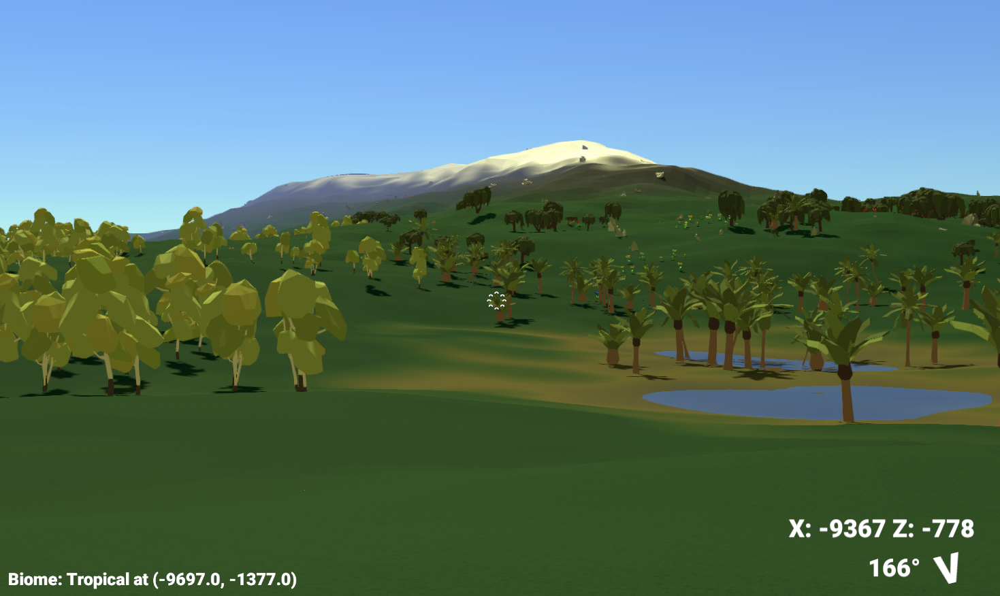

# Terrain Generator

This game was made following this tutorial: https://www.youtube.com/watch?v=WP-Bm65Q-1Y

Since then I've added a load of procedurally generated assets like flowers, temples, rocks and trees; learned how to use Shader Graph; implemented object pooling and mesh combination to boost performance; added basic navigation and a HUD...  I wonder what I'll do next.

